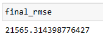
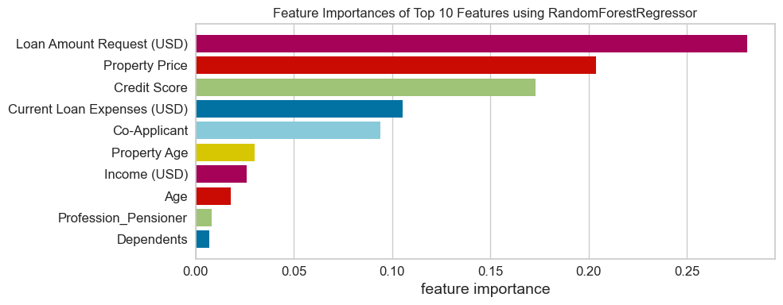
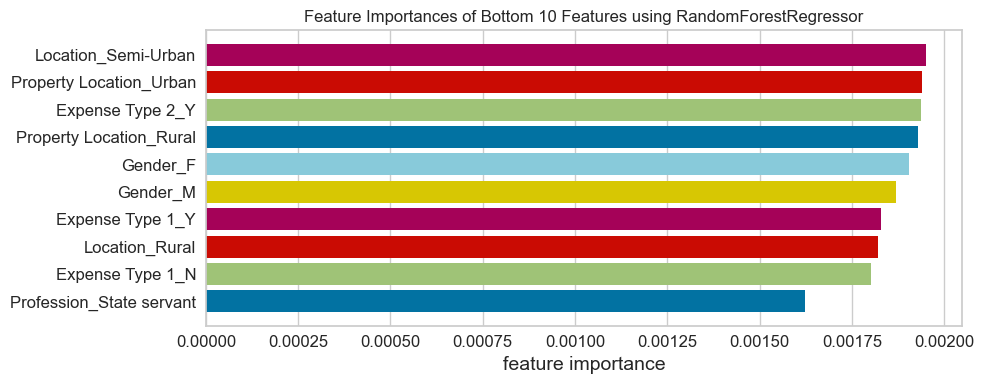

[](https://loan-amount-prediction.streamlit.app/)

# Key Findings: People with the highest credit score, and have a co-applicant, are more likely to receive a large loan amount. 
## Table Of Contents:
- [Business Problem](#business-problem)
- [Data Source](#data-source)
- [Methods](#methods)
- [Tech Stack](#tech-stack)
- [Quick Glance At The Results](#quick-glance-at-the-results)
- [Lessons Learned And Recommendation](#lessons-learned-and-recommendation)
- [Limitations And What Can Be Improved](#limitations-and-what-can-be-improved)
- [Explore The Notebook](#explore-the-notebook)
- [Deployment on Streamlit](#deployment-on-streamlit)
- [App Deployed On Streamlit](#app-deployed-on-streamlit)

## Business Problem

This app predicts how much of a loan will be granted to an applicant. The app uses applicant profile and predicts how much will be approved. Usually the applicant with a higher credit score, a co-applicant will be granted a larger loan amount. It depends also on how much the applicant has requested. 

## Data Source
- [Kaggle Loan Amount Prediction](https://www.kaggle.com/phileinsophos/predict-loan-amount-data)

## Methods

- Exploratory Data Analysis
- Bivariate Analysis
- Multivariate Correlation
- S3 Bucket Model Hosting
- Model Deployment

## Tech Stack

- Python *(Refer to requirements.txt for the packages used in this project)*
- Streamlit *(Interface for the model)*
- AWS S3 *(Model Storage)*

## Quick Glance At The Results

Correlation Between The Features: 


RMSE of Random Forest with the best hyperparameters.



We have an RMSE on a range between 0 and 400000

Top features of random forest with the best hyperparameters.



Least useful features of random forest with the best hyperparameters.



Top 3 models (with default parameters)

| Model with the best hyperparameter    | RMSE (range between 0 and 400000) |
| ----------------------------------    | --------------------------------- |
| Random Forest                         | 21565.31                          |
| Bagging                               | 22440.42                          |
| Gradient Boosting                     | 22440.42                          |

- ***The final model used is Random Forest***
- ***Metrics Used: RMSE***
- Random Forest produced the lowest RMSE consistently.

## Lessons Learned And Recommendation

- Based on the analysis in this project, I found out that loan amount that will be granted is determined mainly by the loan amount requested, credit score, and a co-applicant. The least important features are expenses types and gender.
- Recommendation would be to focus more on the most predictive feature when looking at the applicant profile, and pay less attention on the least predictive features.

## Limitations And What Can Be Improved

- The dataset lack a metadata about the features. (What expenses types mean? What does property type 1, 2, 3, 4 mean?)
- Retrain the model without the least predictive features.
- Hyperparameter tuning: I used RandomSearchCV to save time but could be improved by couple of % with GridSearchCV.

## Explore The Notebook

To explore the notebook file [here](https://nbviewer.org/github/Aliya032/loan-amount-prediction/blob/main/loan-amount-prediction-using-regression.ipynb)

## Deployment on Streamlit

To deploy this project on streamlit share, follow these steps:

- first, make sure you upload your files on Github, including a requirements.txt file
- go to [streamlit share](https://share.streamlit.io/)
- login with Github, Google, etc.
- click on new app button
- select the Github repo name, branch, python file with the streamlit codes
- click advanced settings, select python version 3.9 and add the secret keys if your model is stored on AWS or GCP bucket
- then save and deploy!

## App Deployed On Streamlit


```
├── assets


