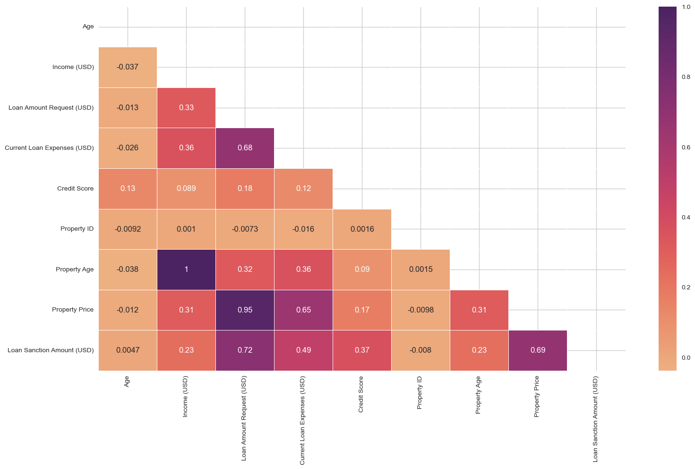

# Key Findings: People with the highest credit score, and have a co-applicant, are more likely to receive a large loan amount. 
## Table Of Contents:
- [Business Problem](#business-problem)
- [Data Source](#data-source)
- [Methods](#methods)
- [Tech Stack](#tech-stack)
- [Quick Glance At The Results](#quick-glance-at-the-results)
- [Lessons Learned And Recommendation](#lessons-learned-and-recommendation)
- [Limitations And What Can Be Improved](#limitations-and-what-can-be-improved)
- [Explore The Notebook](#explore-the-notebook)
- [Deployment on Streamlit](#deployment-on-streamlit)
- [App Deployed On Streamlit](#app-deployed-on-streamlit)
- [Repository Structure](#repository-structure)

## Business Problem

This app predicts how much of a loan will be granted to an applicant. The app uses applicant profile and predicts how much will be approved. Usually the applicant with a higher credit score, a co-applicant will be granted a larger loan amount. It depends also on how much the applicant has requested. 

## Data Source
- [Kaggle Loan Amount Prediction](https://www.kaggle.com/phileinsophos/predict-loan-amount-data)

## Methods

- Exploratory Data Analysis
- Bivariate Analysis
- Multivariate Correlation
- S3 Bucket Model Hosting
- Model Deployment

## Tech Stack

- Python *(Refer to requirements.txt for the packages used in this project)*
- Streamlit *(Interface for the model)*
- AWS S3 *(Model Storage)*

## Quick Glance At The Results

Correlation Between The Features: 

